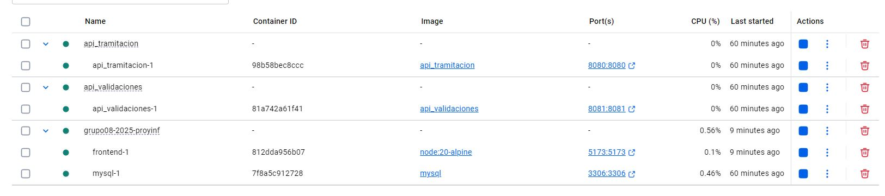

# Grupo 5 

Este es el repositorio del *Grupo 5*, cuyos integrantes son:

* Ignacia Torres Bustos - 202373009-2
* Diego Alonso Medina Vasquez - 202373040-8
* Juan Pablo Fuenzalida Fredes - 202373102-1
* Catalina Paz Zenteno Sanjuanes - 202373003-3
* Williams Ajata - 202204067-k
* **Tutor**: Moisés Villarroel

## Wiki

Puede acceder a la Wiki mediante el siguiente [enlace](https://gitlab.com/WhenBut18/grupo08-2025-proyinf/-/wikis/home)

## Tablero
Link de acceso al tablero: https://tablero-digital.dcc.uchile.cl/invite/board/163/d1da8f219b7b38cf 

## Videos

* [Video presentación cliente](https://aula.usm.cl/pluginfile.php/7621199/mod_resource/content/2/video1352931478.mp4)
* [Video Prototipo H3](https://youtu.be/NqstnWFxQvM)
* [Video resultado final](https://youtu.be/9D4PzlkmUjU)

## Aspectos técnicos relevantes
Se ocupo Vite y React para el frontend.

## Requerimientos

Para utilizar el proyecto base debe tener instalado [Node.js](https://nodejs.org/en), [Docker](https://www.docker.com/) y se recomienda [Postman](https://www.postman.com/) para poder probar los endpoints de las APIs.
Además, para el frontend se debe tener instalado [Vite](https://vite.dev/guide/).

## Levantando el proyecto
El proyecto se debe levantar con el comando:
```
docker compose up --build
```
> ⚠️ Cuando escriban ``docker compose up --build``, es normal que aparezcan errores al principio en la terminal. Esto pasa porque la API necesita conectarse a la base de datos. Si bien Docker levanta la BD y luego la api, la primera se levanta mucho más lento que la api! Así que la api lanza errores mientras espera que la base de datos esté lista. Es decir, no entren en pánico y esperen que diga: "Server running!"
Además, luego se debe colocar el siguiente comando para el frontend:
```
docker compose --profile frontend up -d
```
Las bases de datos se crean automaticamente al levantar el docker.

Una vez creado el archivo, se levantará el contenedor de la API. 
Primero se debe entrar en la carpeta de "API_TRAMITACION" y escribir:
```
docker compose up --build -d
```
y lo mismo para la carpeta de "API_VALIDACIONES" y "API_USUARIOS"

Una vez levantado todo, deberían poder ver en Docker todos sus contenedores corriendo:



Al final, se debe ir al navegador a `http://localhost:5173`, donde se encuentra el home de la página.

### Enjoy!

Limpieza del sistema para reiniciar tdo
docker system prune -f